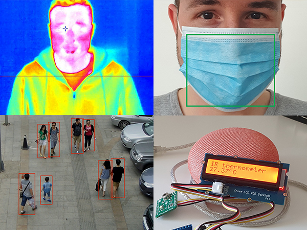
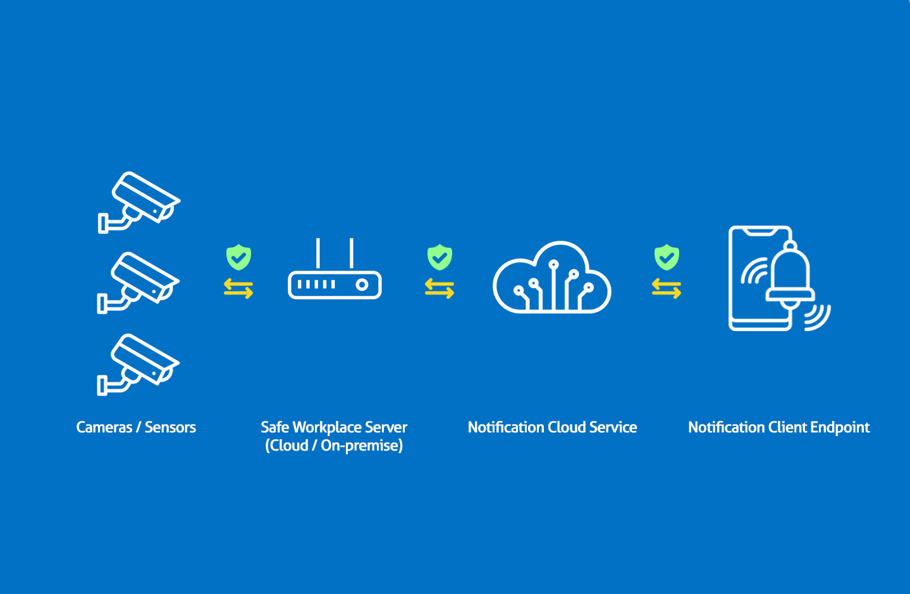
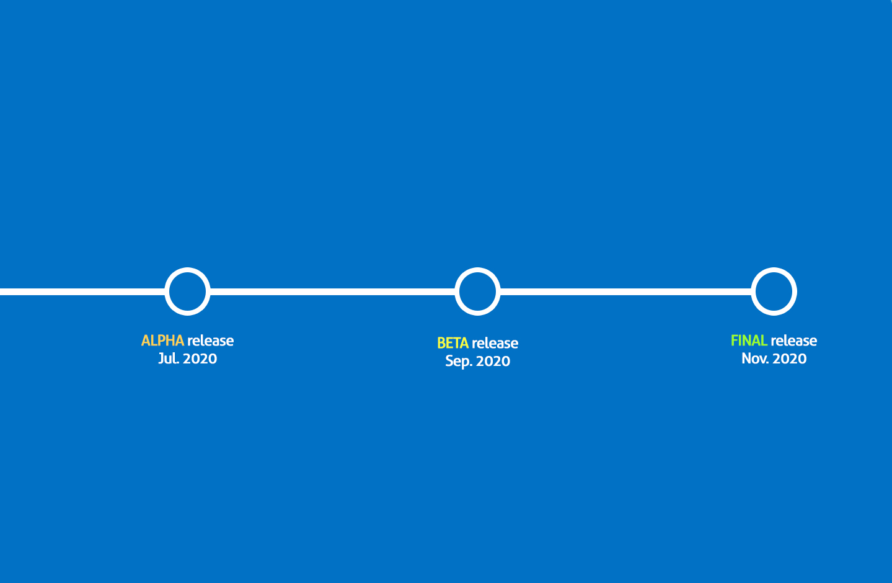

## About
Safe Workplace Robot is an AI-enabled software solution for keeping people safe at their workplace

## Features
- Automatic detection of people not wearing basic protection gear
- Automatic detection of close proximity groups and crowding
- Automatic contact-less high temperature detection checkpoints

## Demo videos

## Objectives
1. Make workplaces safe for employees
2. Help companies and organizations prevent future shut-downs
3. Assist the economy by keeping people healthy

## Architecture and roadmap

*This repo is work-in-progress for the pan-European #EUvsVIRUS hackathon - https://euvsvirus.org
